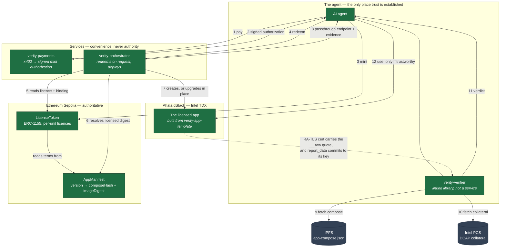
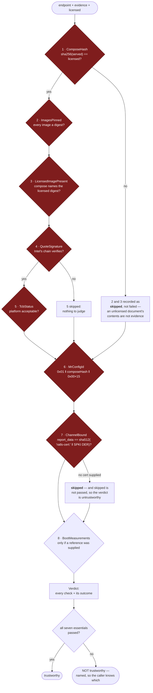
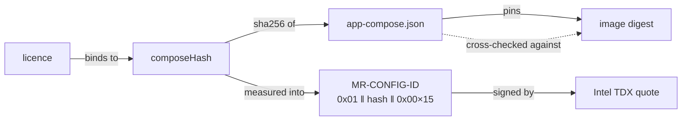

# Architecture

**Status:** active — describes the system as built on 2026-08-08.
**Scope:** how the parts fit together and where the trust boundary runs. The system-level *rationale*
lives in [`Verity-spec.md`](Verity-spec.md) §3–§4; the per-component detail belongs in
[`architecture/components/`](architecture/components/) as those documents get written.

> Diagrams here describe what **runs**, not what is planned. Where something is unbuilt it is marked
> as such and drawn dashed. An architecture document that quietly includes intentions is worse than
> one that omits them, because it cannot be used to reason about a failure.

## Reading order

1. [`Verity-spec.md`](Verity-spec.md) — the invariant, the primary scenario, the settled decisions.
2. This document — the shape, and where the boundary runs.
3. [`architecture/flows/`](architecture/flows/) — end-to-end sequences (not yet written).
4. [`architecture/components/`](architecture/components/) — one document per component (not yet written).
5. [`decisions/`](decisions/) — why each of the above is shaped the way it is.

---

## 1. The system

The defining property is **`licensed_composeHash == attested_composeHash`** (C6): what you licensed
is what runs, and you can check that yourself rather than being told it.

Everything below follows from one structural choice — **the check runs on the agent's side, in code
the agent links**. Nothing in the middle is asked to vouch for anything, which is why no box here is
a gatekeeper (spec §1).



**The one arrow that matters** is the dashed one. The agent does not take the orchestrator's word
that the right thing is running; it parses the raw TDX quote out of the RA-TLS certificate the CVM
itself presents, and compares it against what the chain says was licensed. Every other arrow could
be lying and the verdict would still be correct.

### Where the trust boundary runs

| Side | Components | What a compromise here costs |
|---|---|---|
| **Inside the boundary** | `LicenseToken`, `AppManifest`, the TDX hardware, `verity-verifier` | Everything. These are what the guarantee rests on. |
| **Outside it** | `verity-payments`, `verity-orchestrator`, IPFS gateways, any UI | Availability and money, never the guarantee. A hostile orchestrator can refuse to deploy, or deploy the wrong thing — and the verifier refuses it. |

This is why the orchestrator is its own repo with no shared datastore and no caller-supplied input
(invariant I3, expressed as a repo boundary). It is designed to be replaceable by permissionless
workers (§2.8), and that exit stays open only while it holds no discretion.

---

## 2. Purchase → deploy → verify

The primary scenario, as implemented. Payment and entitlement are one act: the 402-gated resource
**is** the signed mint authorization, so there is no window in which someone has paid and is not
entitled (invariant I4).

```mermaid
sequenceDiagram
    autonumber
    participant A as AI agent
    participant P as verity-payments
    participant C as Chain
    participant O as verity-orchestrator
    participant D as dStack (TDX)
    participant V as verity-verifier<br/>(in the agent)

    A->>P: GET /purchase
    P-->>A: 402 Payment Required
    A->>P: EIP-3009 transferWithAuthorization
    Note over P: settle() returns only once<br/>the receipt says success —<br/>a reverted transfer is not settled
    P-->>A: signed MintAuthorization

    A->>C: LicenseToken.mint(auth, signature)
    Note over C: one licence = one entitlement<br/>(ADR 0023, per-unit ids)
    C-->>A: licenseId

    A->>O: redeem(licenseId)
    Note over A,O: pull, not push. Nothing watches the chain —<br/>a redemption happens because someone asked (ADR 0030)
    rect rgb(60, 50, 30)
    Note over O,D: UNBUILT — `ChainReader` and `Platform` are traits whose only<br/>implementations are test fakes. The decision is built and tested;<br/>the adapters on either side of it are not. This band is design.
    O->>C: license(id) + instanceOf(licenseId)
    Note over O: the *binding* decides create vs upgrade, never the<br/>licence id — that changes at upgrade, and keying on it<br/>is how a fresh deploy silently replaces a volume (ADR 0029)
    O->>C: AppManifest.versionRecord(licensed version)
    Note over O: the digest bound to the holder's licence —<br/>never the newest entry (ADR 0003)
    O->>D: create — or upgrade in place, if bound
    D-->>O: app_id, cvm_id, instance_id, endpoint
    O-->>A: endpoint + attestation evidence + instance_id
    end

    A->>C: bindInstance(licenseId, instanceId)
    Note over A,C: holder-claimed, write-once (ADR 0024), and it comes<br/>*after* the first redemption because the instance_id<br/>is what redemption returns
    Note over O,A: the endpoint must be the TLS-passthrough form<br/>(appId-PORTs.domain — note the trailing s) or the agent's<br/>TLS peer is the gateway and nothing can be<br/>channel-bound (ADR 0027)

    A->>V: verify(endpoint, evidence + leaf cert, licensed)
    V-->>A: Verdict
    alt every essential check passed
        A->>D: use the tool
    else anything failed or never ran
        A--xD: refuse
    end
```

**`bindInstance` is the holder's act, not the orchestrator's.** Having the orchestrator write it
would hand that component authority over who owns what, which is the discretion §2.8 says it must
never acquire.

---

## 3. What verification actually checks

`verity-verifier` performs eight checks and reports each one individually. **A verdict is never a
bare boolean** (ADR 0014 decision 1) — that is what makes a weakened verifier detectable, because
one that stopped comparing `MR-CONFIG-ID` still returns "verified" but can no longer claim to have
compared it.



Checks 1–7 are **essential**: the verdict is untrustworthy unless every one of them ran *and*
passed. Check 8 is not — it compares against a reference the caller supplies, and most callers have
none, so its absence is a configuration rather than a gap.

**Check 7 is what makes the other six about a connection rather than about a machine somewhere.**
Without it a genuine quote — including one recorded from a CVM that no longer exists — paired with an
attacker's endpoint passes checks 1–6 and returns trustworthy
([ADR 0027](decisions/0027-channel-binding-is-an-essential-check.md)). It is only implementable
against dStack's **TLS-passthrough** endpoint form (`<app_id>-<port>s.<domain>`); on the terminating
form the client is handed a valid Let's Encrypt certificate for the gateway, so ordinary TLS
verification succeeds while the peer is not the enclave. A check-7 failure against a terminating
endpoint means the endpoint form is wrong — never that the check is too strict.

It binds the quote to a certificate the caller *supplied*. It cannot establish that the certificate
came from the handshake being judged; the crate performs no I/O. Closing that is MA-1's
`connect_verified`, and until it lands **CR-1 is not finished**.

Three properties that are easy to get wrong and are each a defect this project has actually made:

- **`TcbStatus` is essential.** ADR 0014 decision 2 makes TCB enforcement mandatory and not
  configurable. It was recorded correctly and left out of the essential list, so a genuine quote
  from a platform with a known-vulnerable TCB returned `is_trustworthy() == true`.
- **Skipped is not passed.** A check that did not run cannot support a conclusion, and the verdict
  distinguishes *failed* from *never ran* — the first is the system working, the second is the
  regression ADR 0014 exists to surface.
- **Compare the whole measurement.** Comparing a prefix passes a deployment differing anywhere in
  the tail. Never loosen a check to resolve a mismatch (ADR 0009 rule 3).

### Why `MR-CONFIG-ID` and not the image digest

The licence binds to `composeHash`, not to the image. The image is pinned *transitively*, inside the
compose. A verifier comparing only the image digest would accept the right image running in a wrong
environment — different env vars, an added sidecar, a different volume — which is a partial version
of the skip §4.5 warns degrades the system to "login plus a container spawn".



The cross-check is the enforcement an attacker cannot route around: dStack's own reference compose
uses a *tag*, which keeps `composeHash` stable while the code inside changes freely — every check
passes and the guarantee is gone.

---

## 4. Upgrade and migration

Three steps, and **two of them are decisions the holder makes separately, on purpose**. Minting is
not consent to migrate (invariant I10): a holder may want the new version without their running
instance being touched, and may stop after Act 1 indefinitely.

**Acts 2 and 3 are not the same thing, and conflating them is the mistake this section exists to
prevent.** Act 2 moves the *code*: the CVM is upgraded in place and the encrypted volume comes along
untouched, because the volume follows `app_id` and `app_id` survives. Act 3 transforms the *data*,
and most apps need nothing there — ADR 0008's phrasing is that `migrate` exists to transform data,
not to move it. An app that treats the upgrade as its cue to migrate has implemented the
automigration I10 forbids.

**Ordering constraint:** a `migrate` call is accepted only once the instance is running `toDigest`.
Act 3 before Act 2 asks the *old* code to perform the new version's migration, which is at best a
no-op and at worst a corruption the attestation would have no reason to flag.

```mermaid
sequenceDiagram
    autonumber
    participant H as Holder
    participant C as Chain
    participant O as verity-orchestrator
    participant APP as The running app

    Note over H,C: Act 1 — acquire the new version
    H->>C: LicenseToken.upgrade(auth, signature)
    Note over C: burn + mint atomically.<br/>No two-instance window,<br/>so §2.9 needs no exemption.
    C-->>H: new licenseId, instance binding carried forward

    Note over H,O: Act 2 — the CVM is moved to the new digest
    rect rgb(60, 50, 30)
    Note over O,APP: UNBUILT — no platform adapter exists, so nothing<br/>in this band has ever executed against dStack (see §6)
    H->>O: redeem(newLicenseId)
    O->>C: instanceOf(newLicenseId)
    Note over C,O: the binding was carried forward by upgrade,<br/>so this resolves — and the orchestrator upgrades<br/>rather than creates (ADR 0029)
    O->>APP: phala deploy --cvm-id (in place)
    Note over APP: app_id, instance_id and the encrypted<br/>volume all survive. Without --cvm-id this is a<br/>fresh CVM and the volume is gone (ADR 0008)
    end

    Note over H,APP: Act 3 — and only if the holder asks
    H->>H: sign EIP-712 MigrationAuthorization
    H->>O: hand it over
    O->>APP: relay it, unaltered
    Note over O: carrying is not authoring —<br/>the orchestrator adds nothing
    APP->>C: resolve the *current* holder
    Note over APP: licences transfer (§2.6), so a<br/>deploy-time owner would let a previous<br/>holder sign after selling
    APP->>APP: verify signature, check expiry<br/>and instanceId
    APP-->>O: Complete | Failed | NeedsHolderAction
```



**Upgrade is in place** (ADR 0008, measured on real TDX). State continuity follows `app_id`, not
`compose_hash`: dStack's upgrade path preserves `app_id`, `instance_id` and the encrypted volume,
while a *fresh deploy* gets a new `app_id` and therefore no access to prior state.

> This fails silently and in the worst direction. A fresh deploy produces a **working** instance
> with **empty** state and **no error** — nothing in the attestation is wrong. The holder loses
> everything and finds out later. Re-verify on any dStack version bump.

`MigrateOutcome` is tri-state rather than a boolean, so an app that needs its owner to decide
something can say so instead of guessing or failing. `NeedsHolderAction` must be emitted as
telemetry, not merely returned — an instance parked there is indistinguishable from a slow migration
until somebody looks, and nobody looks.

---

## 5. Component map

| Component | Spec | Repo | Language | State | Doc |
|---|---|---|---|---|---|
| `LicenseToken` (ERC-1155) | §4.1 | `verity-contracts` | Solidity | **deployed** (Sepolia) | not yet written |
| `AppManifest` + factory | §4.1 | `verity-contracts` | Solidity | **deployed** (Sepolia) | not yet written |
| Session-key policy (ERC-4337) | §4.1, §2.7 | `verity-contracts` | Solidity | deferred — ADR 0002 | — |
| x402 → mint authorization | §4.2 | `verity-payments` | TypeScript | built, **designated throwaway** | not yet written |
| Orchestrator | §4.3, §2.8 | `verity-orchestrator` | Rust | **decision logic built and tested; no adapters** — `ChainReader` and `Platform` have no implementation outside test fakes | not yet written |
| Confidential execution | §4.4 | — (nodes **v0.5.7**, guest image 0.5.9) | — | **verified on real TDX** 2026-08-08 | not yet written |
| Agent-side verifier | §4.5 | `verity-verifier` | Rust + WASM | built, refusal proven live | not yet written |
| App lifecycle contract | §5 | `verity-app-template` | TS + Python | built | not yet written |
| Discovery (llms.txt / IPFS) | §4.6 | — | — | **not built** | — |
| Published tool (Pandoc) | §5 | `verity-tool-pandoc` | — | **not built** — ADR 0020 | — |
| Human surfaces | §2.7, §2.3 | `verity-ui` | — | **not built** — RFC open | needs research |
| Wayfinder (navigation) | — | `verity-foundation` | Rust | handlers built, **no transports** | — |

Deployed on Ethereum Sepolia (testnet only, ADR 0002 condition 1):

| Contract | Address |
|---|---|
| `LicenseToken` | `0xD94E1A828C76e7E9868cc25EEe530663535fA275` |
| `AppManifestFactory` | `0x4b264B94b2dB4a2202098bBF6E60Af4f23fC41F0` |
| `AppManifest` (demo) | `0x5F9D8F4f5De8Fd5EF719D748Aa944A879da25aeb` |

## 6. What is not built

Stated because a diagram that omits its own gaps invites someone to plan against them:

- **No published tool.** `verity-tool-pandoc` does not exist, so the loop has never run end to end
  with a real product at the far end.
- **No discovery layer.** §4.6's llms.txt/IPFS index is unbuilt. Nothing is required to be listed —
  that is the point — but nothing lists anything yet either.
- **No account abstraction**, and therefore **no spend envelope**. ADR 0002 defers it under three
  binding conditions, the first being testnet only. There must be no pretense of a limit in the
  meantime: a check the agent can edit is worse than none.
- **No deployed infrastructure.** `nix flake check` passes; no machine has been built from it.
- **The orchestrator cannot deploy anything, and this is stronger than "has not been run".**
  `ChainReader` and `Platform` are traits whose only implementations are test fakes; there is no HTTP
  client, no `phala` invocation, no adapter of any kind. What exists is the decision — which CR-2
  made a pure function of the on-chain binding, and which is now well tested — with nothing wired to
  either side of it. **This is the largest untested path in the system**, and writing those adapters
  is where ADR 0008's silent data loss actually becomes reachable: `phala deploy` creates a *new* CVM
  without `--cvm-id` and updates in place with it, so the failure is one missing argument on the same
  command. It is also where MA-12 lands — the endpoint the adapter reports must be the
  TLS-passthrough form, or nothing an agent receives can be channel-bound (ADR 0027).
- **L-01 and L-05 have never run — and the blocker is not the one previously stated here.** L-01
  is not executable as written: it invokes a `verity-payments` script that no longer exists, its
  deploy/verify/use legs are printed instructions rather than assertions, and the orchestrator
  adapters above are what it would drive. L-05 needs registry network access and **no** keys (its
  own header), but its registry call has no timeout and its template path resolves against the
  caller's cwd. Found by the 2026-08-23 external audit
  ([`records/audits/verity-foundation/2026-08-23-project-audit.md`](../records/audits/verity-foundation/2026-08-23-project-audit.md));
  tracked as EA-2 in
  [`../audit-implementation-plan.md`](../audit-implementation-plan.md).
- **No newer *platform* has been verified.** L-02, L-03 and L-04 all ran on 2026-08-08 against
  guest image `dstack-0.5.9`, but **both nodes still run v0.5.7** — the version everything was
  originally measured on. The re-verification varied the guest image and held the platform
  constant; see [the correction](../records/experiments/2026-08-08-correction-guest-image-is-not-the-node-version.md).
  Node runtime, guest image and dstack's own components version independently.
- **Check 7, `boot_measurements`, first executed on 2026-08-08** and passed, against a reference
  captured from one CVM and matched on another
  ([record](../records/experiments/2026-08-08-first-boot-measurement-check.md)). Note what the
  verifier bundles: OS image *identity* (name, `os_image_hash`, revoked) and **no register values**,
  so a boot reference is always captured, never derived. The one that exists describes guest image
  0.5.9 on a node at v0.5.7, on one node only, and nothing gates it staying correct.

## Invariants

Spec §7 (I1–I10), plus the control-center invariants in [`../CLAUDE.md`](../CLAUDE.md) §4 (C1–C6).
Every architecture document must state which invariants its component upholds.

Two that constrain this document specifically:

- **C4** — never describe Verity as "trustless". Trust-minimized or verifiable. The TDX hardware,
  Intel's signing infrastructure and the developer are all trusted; what is removed is the need to
  trust the *operator*.
- **C6** — the property is `licensed_composeHash == attested_composeHash`. The older
  `licensed_digest == attested_digest` is imprecise and survives only inside immutable records.
